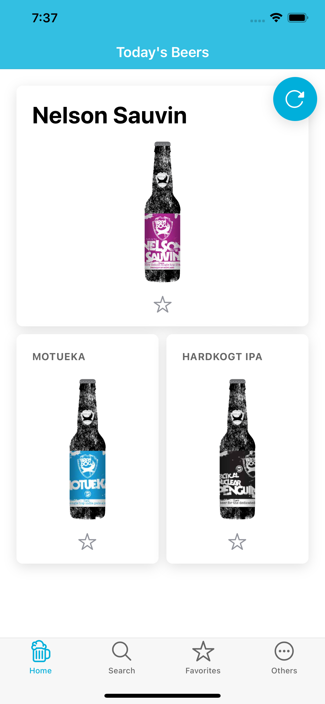
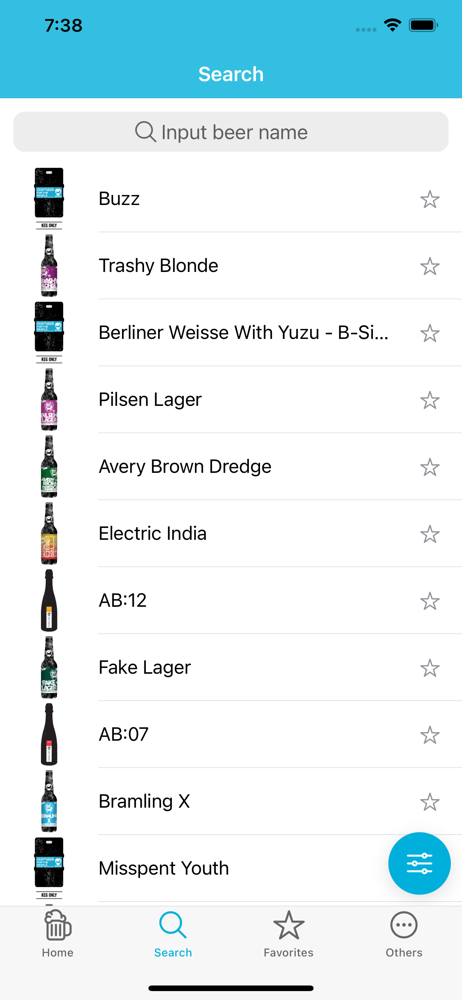
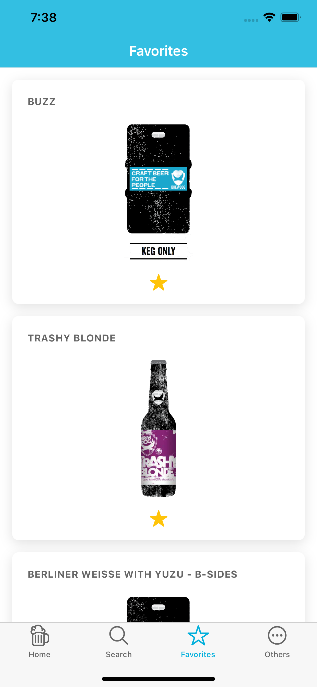

# Punk Brewser🍺

## About The Project

Punk Brewser is a mobile app you can browse any beers from [BrewDog](https://brewdog.com).

All beers data are fetched by [PUNK API](https://punkapi.com/documentation/v2).

## Platform

Available on Android and iOS.

## Features

- Show random beers
- Search and filter beers by name, IBU, etc...
- Show beer detail
- Save favorite beers

## Tech Stack

## Getting Started

1. Clone this repository: `https://github.com/EngiBeerHub/punk-brewser.git`
2. Run `npm install` from the project root.
3. Install Ionic CLI if you haven't: `npm install -g @ionic/cli`
4. Run `ionic serve` from the project root.

## Contributing

You are welcome to contribute🎉

## License

Distributed under MIT license. See `LICENSE` for more information.
